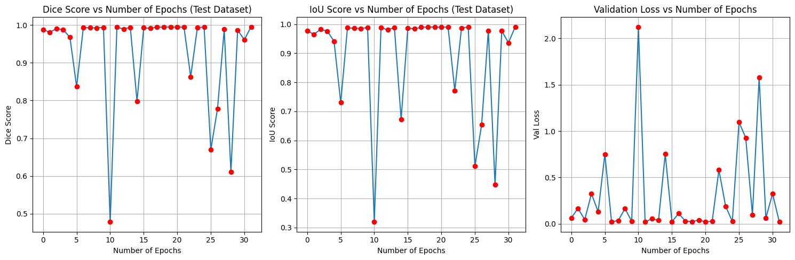
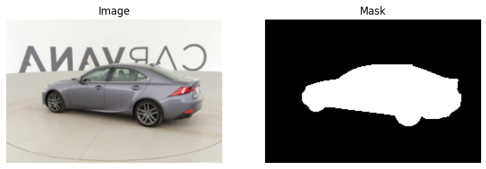
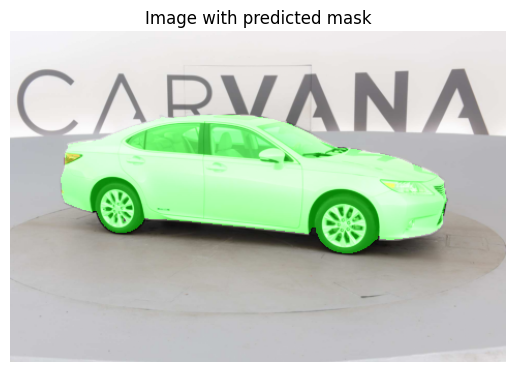

# Nested U-Net (U-Net++) for Car Segmentation

This project implements the **Nested U-Net (U-Net++)** architecture for **image segmentation**, specifically focusing on car segmentation. U-Net++ improves upon the original U-Net by introducing **nested skip pathways**, enhancing the flow of information between the encoder and decoder. The implementation is built using **PyTorch** and leverages data from the [Carvana Image Masking Challenge](https://www.kaggle.com/competitions/carvana-image-masking-challenge/overview).

## Table of Contents
- [Introduction](#introduction)
- [Features](#features)
- [Installation](#installation)
- [Model](#model)
- [Training and Testing](#training-and-testing)
- [Metrics](#metrics)
- [Evaluation](#evaluation)
- [Results](#results)

## Introduction
U-Net++ is a convolutional neural network (CNN) designed for **semantic segmentation**. Unlike traditional U-Net, U-Net++ incorporates **dense skip connections**, which improve gradient flow and feature reuse. This enables the model to learn fine-grained details more effectively, making it particularly useful for **car segmentation** and other image segmentation tasks.

## Features
- **Nested Skip Connections**: Enhances feature fusion between encoder and decoder.
- **Efficient Encoder-Decoder Structure**: Retains spatial information while learning hierarchical features.
- **Data Augmentation**: Improves generalization by applying transformations to training images.
- **PyTorch Implementation**: Fully compatible with GPU acceleration for faster training.

## Installation
Clone this repository and install dependencies:

```bash
git clone https://github.com/kevingeorgedev/Car-Segmentation-Nested-UNet.git
cd unet-image-segmentation
pip install -r requirements.txt
```

Additionally, install **PyTorch** following the official guide: [PyTorch Installation](https://pytorch.org/get-started/locally/).

## Model
### Overview
This implementation of Nested U-Net (U-Net++) is designed for image segmentation tasks, featuring dense convolutional blocks, nested skip pathways, and deep supervision. The network can handle varying depth levels (L) and offers configurable options for output supervision.

### Model Components
#### 1. `ConvBlock` (Dense Convolutional Block: $X^{i, j} \text{ Convolution}$)
This is the basic building block of the Nested U-Net, consisting of two convolutional layers followed by batch normalization and ReLU activation.
```python
class ConvBlock(nn.Module):
    def __init__(self, in_channels, out_channels):
        super(ConvBlock, self).__init__()
        self.block = nn.Sequential(
            nn.Conv2d(in_channels=in_channels, out_channels=out_channels, kernel_size=3, padding=1, stride=1),
            nn.BatchNorm2d(out_channels),
            nn.ReLU(inplace=True),
            nn.Conv2d(in_channels=out_channels, out_channels=out_channels, kernel_size=3, padding=1, stride=1),
            nn.BatchNorm2d(out_channels),
            nn.ReLU(inplace=True)
        )

    def forward(self, x):
        return self.block(x)
```
#### 2. `UNET` (Nested U-Net Model)
The U-Net model consists of multiple levels (L), where each level includes convolutional blocks and skip connections. It allows for deep supervision, meaning multiple outputs at different levels can be used to guide training.
##### **Key Features:**
- **Backbone:** The contracting path extracts feature maps using convolutional blocks.
- **Dense Nested Layers:** Multiple convolutional blocks are used per level.
- **Upsampling:** Uses bilinear interpolation to scale up feature maps.
- **Deep Supervision:** If enabled, multiple outputs are used for loss calculation.
##### **Initialization Parameters:**
- **in_channels:** Number of input channels.
- **out_channels:** Number of output channels.
- **first_feature:** Initial feature size (doubles per layer).
- **L:** Depth of the network (maximum 4).
- **deep_supervision:** Boolean flag for deep supervision.
- **device:** Defines the computing device.
```python
class UNET(nn.Module):
    def __init__(self, in_channels=3, out_channels=1, first_feature=32, L=4, deep_supervision=True, device='cpu'):
        super(UNET, self).__init__()

        # Ensure the proper parameters are given
        assert isinstance(in_channels, int), "in_channels must be an integer"
        assert isinstance(out_channels, int), "out_channels must be an integer"
        assert isinstance(first_feature, int), "first_feature must be an integer"
        assert isinstance(L, int), "L must be an integer"
        assert L <= 4 and L > 0, "L must be in range [1, 5)"
        assert isinstance(deep_supervision, bool), "deep_supervision must be True or False"

        # L is used in defining how deep the network is. Essentially, there will be L + 1 layers (top to bottom of triangular architecture)
        # with each layer having one less cell than the last. Paper uses L in range [1, 4]
        self.L = L

        # Device to send tensors to
        self.device = device

        # Deep supervision will define if the model backward propogates using all cells of the top layer (excluding backbone)
        self.deep_supervision = deep_supervision

        # Feature dimensionality of the model (paper starts with 32 and increases by 2 each layer)
        features = [first_feature * 2 ** x for x in range(0, L + 1, 1)]

        # Backbone modules and pooling
        self.backbone = nn.ModuleList([])
        self.pool = nn.MaxPool2d(2, 2)

        # Create dense convolutional blocks as backbone
        for feature in features:
            self.backbone.append(ConvBlock(in_channels, feature))
            in_channels = feature

        # Create 2-dimensional list of nested dense convolutional blocks
        self.layers = nn.ModuleList([
            nn.ModuleList([ConvBlock(features[i] * 1 + features[i+1], features[i]) for i in range(L)]),
            nn.ModuleList([ConvBlock(features[i] * 2 + features[i+1], features[i]) for i in range(L - 1)]),
            nn.ModuleList([ConvBlock(features[i] * 3 + features[i+1], features[i]) for i in range(L - 2)]),
            nn.ModuleList([ConvBlock(features[i] * 4 + features[i+1], features[i]) for i in range(L - 3)]),
        ])[:L] # Only use the first L layers

        # Upsampling used in paper
        self.up = nn.Upsample(scale_factor=2, mode='bilinear', align_corners=True)

        # Output module depending on deepsupervision
        if deep_supervision:
            self.deep_layers = nn.ModuleList([
                nn.Conv2d(features[0], out_channels, kernel_size=1) for _ in range(L)
            ])
        else:
            self.output = nn.Conv2d(features[0], out_channels, kernel_size=1)
```
##### **Forward Pass**
```python
    def forward(self, x):
        # Skip connections array, updates to skip_connections will eventually form 
        # what looks like an upper triangular matrix the is flipped horizontally
        skip_connections = []

        # Create the backbone
        back_bone_skip = []
        for idx, block in enumerate(self.backbone): #  Iterate backbone layers
            x = block(x)             #  Forward propagation for each layer of backbone
            back_bone_skip.append(x) #  Append skip connection to backbone
            if idx != self.L:        #  Not necessary to pool for last layer of backbone
                x = self.pool(x)     #  Max pool for next layer

        # Append backbone layer to skip connections and delete back_bone skip from memory
        # because it won't be used anymore
        skip_connections.append(back_bone_skip)
        del back_bone_skip

        # Iterate throught all nested layers
        for i in range(len(self.layers)):
            layer_skips = []                                        #  Array that holds the output skips for each cell in layer
            for l, layer in enumerate(self.layers[i]):              #  Enumerate the nested cells in layer
                cat_connections = []                                #  Connections to concatenate after forward propagation
                for k in range(i + 1):                              #  Iterate all previous cells in layer besides backbone
                    cat_connections.append(skip_connections[k][l])  #  Append nested cell to concatenate later
                cat_connections.append(self.up(skip_connections[i][l+1]))
                cat_connection = torch.cat(cat_connections, dim=1)  #  Finally, concatenate all cells to propagate through the next
                layer_skip = layer(cat_connection)                  #  Forward propagation for next cell
                layer_skips.append(layer_skip)                      #  Append new cell forward propagation to layer skips

            skip_connections.append(layer_skips)                    # Add layer skips to skip connections

        # We only want the output of each cell in the top row of architecture (besides backbone)
        # If not using deep supervision, use the output of cell x_(0, L)
        if self.deep_supervision: 
            return [self.deep_layers[x](skip_connections[x+1][0]) for x in range(self.L)]
        else: 
            return self.output(skip_connections[-1][-1])
```

## Training and Testing
### Loss Function
The model trains on a combination of cross entropy loss and dice loss.
```python
def dice_loss(pred, target, smooth=1e-6):

    pred = torch.sigmoid(pred) # Ensure it's in the range [0,1]
    
    # Flatten tensors to (N, H*W) for easier computation
    pred = pred.view(pred.shape[0], -1)
    target = target.view(target.shape[0], -1)

    # Compute intersection and union
    intersection = (pred * target).sum(dim=1)
    union = (pred + target).sum(dim=1)

    # Compute Dice coefficient
    dice = (2. * intersection + smooth) / (union + smooth)
    
    # Return Dice loss (1 - Dice coefficient)
    return 1 - dice.mean()

def dice_bce_loss(pred, target, alpha=0.5):
    bce = F.binary_cross_entropy_with_logits(pred, target)
    dice = dice_loss(pred, target)
    return alpha * bce + (1 - alpha) * dice
```

### Model Instantiation
```python
model = UNET(in_channels=IN_CHANNELS, out_channels=OUT_CHANNELS, L=L, deep_supervision=deep_supervision, device=device).to(device)
optimizer = optim.Adam(model.parameters(), lr=3e-4)

if use_pretrained:
    model.load_state_dict(checkpoint['model_state_dict'])
    optimizer.load_state_dict(checkpoint['optimizer_state_dict'])

loss_fn = dice_bce_loss
```

### Early Stopping
In order to help prevent overfitting, I implemented an EarlyStopping class that can detect if the validation loss has not improved for a set amount of epochs (`patience`).
```python
from copy import deepcopy

class EarlyStopping:
    def __init__(self, model, patience=20, mode="min"):
        self.patience = patience
        self.best_value = float('inf') if mode == "min" else -float('inf')
        self.counter = 0
        self.mode = mode
        self.model = model
        self.best_weights = None

    def __call__(self, metric):
        if self.mode == "max":
            improvement = metric - self.best_value
            if improvement > 0:
                self.best_value = metric
                self.counter = 0
                self.best_weights = deepcopy(self.model.state_dict())
            else:
                self.counter += 1
        elif self.mode == "min":
            improvement = self.best_value - metric
            if improvement > 0:
                self.best_value = metric
                self.counter = 0
                self.best_weights = deepcopy(self.model.state_dict())
            else:
                self.counter += 1

        return self.counter >= self.patience
    
early_stopping = EarlyStopping(model)
```

### Training Step
The `train_step` function trains the model on a batch of data using a loss function and optimizer.
```python
    def train_step(self, loader: DataLoader, criterion, optimizer: torch.optim.Adam, epoch: int, num_epochs: int, miniters: int=10):
        self.train()
        total_loss = 0
        loop = tqdm(loader, total=len(loader), desc=f"[{epoch+1}/{num_epochs}] loss=inf", miniters=miniters)
        for idx, (x_batch, y_batch) in enumerate(loop):
            x_batch: torch.Tensor
            y_batch: torch.Tensor
            x_batch, y_batch = x_batch.to(self.device), y_batch.to(self.device)

            optimizer.zero_grad()

            if self.deep_supervision:
                logits = self(x_batch)
                loss = 0
                for logit in logits:
                    loss += criterion(logit, y_batch)
                loss /= len(logits)
            else:
                logits = self(x_batch)
                logits = logits.squeeze(1)
                loss = criterion(logits, y_batch.squeeze(1))
            
            total_loss += loss.item()
            
            if (idx + 1) % miniters == 0:
                loop.desc = f"[{epoch+1}/{num_epochs}] loss={(total_loss / (idx + 1)):.4f}"

            loss.backward()
            optimizer.step()

        return total_loss / len(loader)
```
Code used to train the model.
```python
model.train()
for epoch in range(num_epochs):
    loss = model.train_step(train_loader, loss_fn, optimizer, epoch, num_epochs)

    total_iou = 0
    total_dice = 0
    for x, y in test_dataset:
        total_iou += model.iou_score(x, y)
        total_dice += model.dice_score(x, y)
        
    iou_score_track.append(total_iou / len(test_dataset))
    dice_score_track.append(total_dice / len(test_dataset))
    
    resulting_image = model.visualize_prediction(test_image, show=False)
    images.append(resulting_image)

    val_loss = model.evaluate(test_loader, loss_fn)
    val_loss_track.append(val_loss)

    early_stop = early_stopping(val_loss)

    print(f"\tIoU Score = {(total_iou / len(test_dataset)):.4f}, "
        f"Dice Score = {(total_dice / len(test_dataset)):.4f}, "
        f"Val Loss = {val_loss:.4f}, "
        f"Train Loss = {loss:.4f}, "
        f"patience = {early_stopping.counter}/{early_stopping.patience}")

    if early_stop:
        print()
        print( "#################################")
        print(f"Early stopping triggered at epoch {epoch+1}")
        break
```
```
Model Training:

[1/200] loss=0.1374: 100%|██████████| 1145/1145 [06:38<00:00,  2.87it/s]
	IoU Score = 0.9768, Dice Score = 0.9882, Val Loss = 0.0643, Train Loss = 0.1370, patience = 0/20
[2/200] loss=0.0349: 100%|██████████| 1145/1145 [06:37<00:00,  2.88it/s]
	IoU Score = 0.9653, Dice Score = 0.9809, Val Loss = 0.1672, Train Loss = 0.0349, patience = 1/20
[3/200] loss=0.0255: 100%|██████████| 1145/1145 [05:53<00:00,  3.24it/s]
	IoU Score = 0.9821, Dice Score = 0.9909, Val Loss = 0.0446, Train Loss = 0.0254, patience = 0/20
[4/200] loss=0.0223: 100%|██████████| 1145/1145 [05:53<00:00,  3.24it/s]
	IoU Score = 0.9761, Dice Score = 0.9877, Val Loss = 0.3248, Train Loss = 0.0223, patience = 1/20
[5/200] loss=0.0198: 100%|██████████| 1145/1145 [05:53<00:00,  3.23it/s]
	IoU Score = 0.9412, Dice Score = 0.9675, Val Loss = 0.1307, Train Loss = 0.0198, patience = 2/20
[6/200] loss=0.0174: 100%|██████████| 1145/1145 [05:54<00:00,  3.23it/s]
	IoU Score = 0.7302, Dice Score = 0.8366, Val Loss = 0.7515, Train Loss = 0.0174, patience = 3/20
[7/200] loss=0.0169: 100%|██████████| 1145/1145 [05:53<00:00,  3.24it/s]
	IoU Score = 0.9876, Dice Score = 0.9937, Val Loss = 0.0206, Train Loss = 0.0169, patience = 0/20
[8/200] loss=0.0153: 100%|██████████| 1145/1145 [05:53<00:00,  3.24it/s]
	IoU Score = 0.9857, Dice Score = 0.9928, Val Loss = 0.0362, Train Loss = 0.0153, patience = 1/20
[9/200] loss=0.0144: 100%|██████████| 1145/1145 [05:53<00:00,  3.24it/s]
	IoU Score = 0.9854, Dice Score = 0.9926, Val Loss = 0.1645, Train Loss = 0.0144, patience = 2/20
[10/200] loss=0.0150: 100%|██████████| 1145/1145 [05:53<00:00,  3.24it/s]
	IoU Score = 0.9884, Dice Score = 0.9941, Val Loss = 0.0273, Train Loss = 0.0150, patience = 3/20
[11/200] loss=0.0133: 100%|██████████| 1145/1145 [05:53<00:00,  3.24it/s]
	IoU Score = 0.3190, Dice Score = 0.4780, Val Loss = 2.1236, Train Loss = 0.0133, patience = 4/20
[12/200] loss=0.0129: 100%|██████████| 1145/1145 [05:53<00:00,  3.24it/s]
	IoU Score = 0.9886, Dice Score = 0.9943, Val Loss = 0.0202, Train Loss = 0.0129, patience = 0/20
[13/200] loss=0.0124: 100%|██████████| 1145/1145 [05:53<00:00,  3.24it/s]
	IoU Score = 0.9802, Dice Score = 0.9898, Val Loss = 0.0545, Train Loss = 0.0124, patience = 1/20
[14/200] loss=0.0123: 100%|██████████| 1145/1145 [05:53<00:00,  3.24it/s]
	IoU Score = 0.9881, Dice Score = 0.9940, Val Loss = 0.0374, Train Loss = 0.0123, patience = 2/20
[15/200] loss=0.0122: 100%|██████████| 1145/1145 [05:53<00:00,  3.24it/s]
	IoU Score = 0.6731, Dice Score = 0.7983, Val Loss = 0.7531, Train Loss = 0.0122, patience = 3/20
[16/200] loss=0.0116: 100%|██████████| 1145/1145 [05:53<00:00,  3.24it/s]
	IoU Score = 0.9859, Dice Score = 0.9928, Val Loss = 0.0234, Train Loss = 0.0116, patience = 4/20
[17/200] loss=0.0112: 100%|██████████| 1145/1145 [05:53<00:00,  3.24it/s]
	IoU Score = 0.9837, Dice Score = 0.9917, Val Loss = 0.1124, Train Loss = 0.0112, patience = 5/20
[18/200] loss=0.0117: 100%|██████████| 1145/1145 [05:53<00:00,  3.24it/s]
	IoU Score = 0.9892, Dice Score = 0.9946, Val Loss = 0.0292, Train Loss = 0.0117, patience = 6/20
[19/200] loss=0.0107: 100%|██████████| 1145/1145 [05:53<00:00,  3.24it/s]
	IoU Score = 0.9900, Dice Score = 0.9950, Val Loss = 0.0243, Train Loss = 0.0108, patience = 7/20
[20/200] loss=0.0106: 100%|██████████| 1145/1145 [05:53<00:00,  3.24it/s]
	IoU Score = 0.9899, Dice Score = 0.9949, Val Loss = 0.0401, Train Loss = 0.0106, patience = 8/20
[21/200] loss=0.0102: 100%|██████████| 1145/1145 [05:53<00:00,  3.24it/s]
	IoU Score = 0.9898, Dice Score = 0.9949, Val Loss = 0.0223, Train Loss = 0.0102, patience = 9/20
[22/200] loss=0.0109: 100%|██████████| 1145/1145 [05:53<00:00,  3.24it/s]
	IoU Score = 0.9898, Dice Score = 0.9949, Val Loss = 0.0284, Train Loss = 0.0109, patience = 10/20
[23/200] loss=0.0098: 100%|██████████| 1145/1145 [05:53<00:00,  3.24it/s]
	IoU Score = 0.7713, Dice Score = 0.8632, Val Loss = 0.5809, Train Loss = 0.0099, patience = 11/20
[24/200] loss=0.0099: 100%|██████████| 1145/1145 [05:53<00:00,  3.24it/s]
	IoU Score = 0.9867, Dice Score = 0.9933, Val Loss = 0.1909, Train Loss = 0.0099, patience = 12/20
[25/200] loss=0.0098: 100%|██████████| 1145/1145 [05:53<00:00,  3.24it/s]
	IoU Score = 0.9904, Dice Score = 0.9952, Val Loss = 0.0257, Train Loss = 0.0098, patience = 13/20
[26/200] loss=0.0097: 100%|██████████| 1145/1145 [05:53<00:00,  3.24it/s]
	IoU Score = 0.5105, Dice Score = 0.6693, Val Loss = 1.0963, Train Loss = 0.0097, patience = 14/20
[27/200] loss=0.0096: 100%|██████████| 1145/1145 [05:53<00:00,  3.24it/s]
	IoU Score = 0.6536, Dice Score = 0.7784, Val Loss = 0.9282, Train Loss = 0.0096, patience = 15/20
[28/200] loss=0.0095: 100%|██████████| 1145/1145 [05:54<00:00,  3.23it/s]
	IoU Score = 0.9780, Dice Score = 0.9886, Val Loss = 0.0946, Train Loss = 0.0095, patience = 16/20
[29/200] loss=0.0097: 100%|██████████| 1145/1145 [05:53<00:00,  3.24it/s]
	IoU Score = 0.4474, Dice Score = 0.6105, Val Loss = 1.5796, Train Loss = 0.0097, patience = 17/20
[30/200] loss=0.0090: 100%|██████████| 1145/1145 [05:53<00:00,  3.24it/s]
	IoU Score = 0.9771, Dice Score = 0.9867, Val Loss = 0.0629, Train Loss = 0.0090, patience = 18/20
[31/200] loss=0.0090: 100%|██████████| 1145/1145 [05:53<00:00,  3.24it/s]
	IoU Score = 0.9359, Dice Score = 0.9613, Val Loss = 0.3253, Train Loss = 0.0090, patience = 19/20
[32/200] loss=0.0092: 100%|██████████| 1145/1145 [05:53<00:00,  3.24it/s]
	IoU Score = 0.9905, Dice Score = 0.9952, Val Loss = 0.0231, Train Loss = 0.0092, patience = 20/20

#################################
Early stopping triggered at epoch 32
```
### Evaluation Step
The `evaluate` function computes the loss over the validation set without updating the model
```python
    @torch.no_grad()
    def evaluate(self, loader: DataLoader, criterion):
        self.eval()
        total_loss = 0

        for x_batch, y_batch in loader:
            x_batch, y_batch = x_batch.to(self.device), y_batch.to(self.device)

            if self.deep_supervision:
                logits = self(x_batch)
                loss = sum(criterion(logit, y_batch) for logit in logits) / len(logits)
            else:
                logits = self(x_batch).squeeze(1)
                loss = criterion(logits, y_batch.squeeze(1))

            total_loss += loss.item()

        return total_loss / len(loader)
```

## Metrics
### IoU Score
Intersection over Union (IoU) measures segmentation accuracy.
```python
    def _iou_calculation(self, outputs: torch.Tensor, labels: torch.Tensor, smooth: float = 1e-6):
        outputs = (outputs > 0.5).float() #  Convert to boolean mask
        labels = (labels > 0.5).float() #  Convert to boolean mask
        
        intersection = (outputs * labels).sum() #  Element-wise AND
        union = (outputs + labels).clamp(0, 1).sum() #  Element-wise OR

        iou = intersection / (union + smooth) #  Smooth to avoid division by zero
        
        return iou.cpu().item() #  Return IoU values
    
    @torch.no_grad()
    def iou_score(self, x: torch.Tensor, y: torch.Tensor):
        self.eval()

        x, y = x.to(self.device), y.to(self.device)
        x = x.unsqueeze(0)

        preds = self(x)[-1] if self.deep_supervision else self(x)

        preds = torch.sigmoid(preds)

        preds = (preds > 0.5).float()
        preds.squeeze_(1)

        return self._iou_calculation(preds, y.squeeze(1))
```
### Dice Score
The Dice coefficient is another metric for evaluating segmentation performance.
```python
    @torch.no_grad()
    def dice_score(self, x: torch.Tensor, y: torch.Tensor):
        self.eval()  # Set model to evaluation mode

        assert 4 >= x.dim() > 2, f"Input dimensions must be in range (2, 4], got {x.dim()}"

        x, y = x.to(self.device), y.to(self.device)

        if x.dim() == 3:
            x = x.unsqueeze(0)
            y = y.unsqueeze(0)

        preds = self(x)[-1] if self.deep_supervision else self(x)
        preds = torch.sigmoid(preds)
        preds = (preds > 0.5).float().squeeze(1) # ,Convert to binary mask

        # Compute Dice Score
        dice_score = (2 * (preds * y).sum()) / ((preds + y).sum() + 1e-8)

        return dice_score.item()
```

## Evaluation
The model is evaluated on standard segmentation metrics:

| Metric     | Value  |
|------------|--------|
| IoU        | 0.989  |
| Dice Score | 0.994  |
| Accuracy   | 99.8%  |



## Results
### Predicted Mask vs. Ground Truth

Side-by-side comparison of a test image and its predicted mask:



### Mask Applied Over Test Image

Overlaying the predicted mask on the original image:



---
**Contributions & Feedback**
Feel free to submit issues, feature requests, or contribute to the repository!

